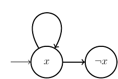

## Leader election

The first example we present concerns a leader election protocol (), which assumes a ring network of processes (nodes) with unique, comparable identifiers. Each node can communicate with its successor in the ring by sending its own identifier, or the identifier it received from its predecessor if it is greater than its own identifier. If a node receives its own identifier, it considers itself as the elected leader. We have modeled this system using Boolean variables only. The LTL formula we checked says that there will eventually be a leader, or more precisely: eventually one of the nodes will receive its own identifier.

This example has been used as benchmark by increasing the size of the ring. The file [ring_10](../files/paper/ring.tat) shows the encoding of a size 10 ring.

## Arithmetic sequence and series

We designed our tool to handle problems involving unbounded variables, arithmetic, and LTL formulas. However, most benchmarks in the literature focus on discrete problems.
This example involves computing an arithmetic sequence and an arithmetic series. We define the transition system for any arithmetic sequence and series, adding the constraint that the series value must be reached after a given number of iterations. The solver must find the initial parameters and all values of the sequence and series.

The file [arith_10](../files/paper/arith_10.tat) represents the encoding of an arithùetic sequence and series of size 10.

## Water Jug problem

The file [water](../files/presentation/eau.tat) is the encoding of the "water jug problem".

## Robot planning

The file [robot_simple](../files/presentation/robot_simple.tat) shows how to encode a planning problem with tatam.


## Robot planning wityh duration

The file [robot_time](../files/presentation/robot_time.tat) shows how to encode a planning problem with duration with tatam.

## nuXmv "inconsistent" semantics

Consider the following simple state machine and the formula $G (x)$ (i.e. $\neg F ( \neg x )$). Obviously, if we want to analyze it with the BDD or IC3 solver, the finite (or truncated) trace leading to $\neg x$ cannot be reached. But it works perfectly with the BMC solver.



In boolean logic, $\varphi$ is equal to $\varphi \land \top$ and $\alpha \lor \neg \alpha$ is equal to $\top$. So $\varphi \land (\alpha \lor \neg \alpha)$ is equal to $\varphi$. Now consider $\alpha = X (\top)$. So $\varphi \land (X (\top) \lor \neg X (\top))$ is equal to $\varphi$. Consequently, $\neg F (\neg x \land (X (\top) \lor \neg X (\top)))$ is equal to $\neg F (\neg x)$. But with *nuXmv* these two formulas are not equal.

The *smv* file can be found [here](files/bug.smv). The command line looks like this
```
nuXmv -bmc bug.smv
```

We can analyze this example with *tatam*. The corresponding file can be found [here](files/nuxmv_bug.tat).
Unlike *nuXmv*, *tatam* gives the expected results.
