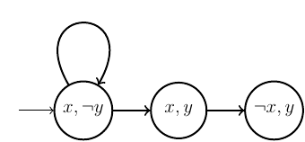

## LTL semantics

We then define an LTL formula and ask the tool to exhibit a trace of the model that satisfies the formula. Remark that if one wants to check whether a formula $\varphi$ is satisfied by all the model traces, then $\lnot \varphi$ has to be specified in **Tatam**: either there is a trace satisfying $\lnot \varphi$ (so it is not the case that $\varphi$ is true for all traces), or there is no trace satisfying $\lnot \varphi$ (so $\varphi$ is true for all traces).

Finally, we specify the kind(s) of traces that we consider in the analysis: <tt>infinite</tt>, <tt>truncated</tt>, <tt>finite</tt> or any combination of the three kinds. For instance, if we want to consider maximal finite traces, we can specify <tt>infinite + finite</tt>. Additionally, we can specify bounds on the trace length: <tt>search[1..20]</tt> means we only search for traces of length $k\in 1..20$. If no bound is specified, the search will go on for any $k\in \mathbb{N}$ until a trace is found or a completeness threshold is reached. To check whether a completeness threshold has been reached for each new length $k$, we use the keyword <tt>complete</tt>. Notice that if there is no trace satisfying the formula and if <tt>complete</tt> is not specified, then the analysis obviously does not stop.

    

