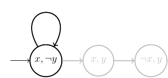
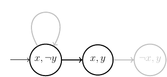
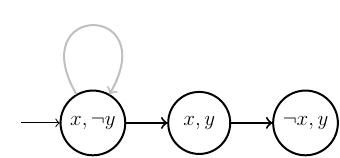

## LTL semantics

We then define an LTL formula and ask the tool to exhibit a trace of the model that satisfies the formula. Remark that if one wants to check whether a formula $\varphi$ is satisfied by all the model traces, then $\lnot \varphi$ has to be specified in **Tatam**: either there is a trace satisfying $\lnot \varphi$ (so it is not the case that $\varphi$ is true for all traces), or there is no trace satisfying $\lnot \varphi$ (so $\varphi$ is true for all traces).

Finally, we specify the kind(s) of traces that we consider in the analysis: <tt>infinite</tt>, <tt>truncated</tt>, <tt>finite</tt> or any combination of the three kinds. For instance, if we want to consider maximal finite traces, we can specify <tt>infinite + finite</tt>. Additionally, we can specify bounds on the trace length: <tt>search[1..20]</tt> means we only search for traces of length $k\in 1..20$. If no bound is specified, the search will go on for any $k\in \mathbb{N}$ until a trace is found or a completeness threshold is reached. To check whether a completeness threshold has been reached for each new length $k$, we use the keyword <tt>complete</tt>. Notice that if there is no trace satisfying the formula and if <tt>complete</tt> is not specified, then the analysis obviously does not stop.

### Example 
In order to illustrate the different semantics for LTL, we consider the simple transition system shown in figure 1, including three states, three transitions and two atomic propositions x and y. 


#### Infinite trace

If we only consider <tt>infinite</tt> traces, in this example, only the first loop stands, and the model can be illustrated below. As a consequence, the formula $G(x)$ will be true on all traces under an infinite semantics.




#### Truncated trace

The <tt>truncated</tt> semantics considers any path in the graph to be an acceptable trace. In particular, the trace shown in the figure below, which ends in the state satisfying $x \land y$, is an acceptable truncated trace. We have that $F G (x \land y)$.



#### Finite trace

Now, if we consider traces that are maximal finite, the trace that ends in the state satisfying $\lnot x\land y$ is taken into account but not the truncated trace ending in the middle state, which satisfies $x\land y$. So, considering maximal trace semantics, we have $\lnot F G (x \land y)$.



#### Comparison

The tatam file of this simple example example is le following one :
```
var x, y: Bool
init I { x and not y }
trans T0 { x and not y and x' and not y' }
trans T1 { x and not y and x' and y' }
trans T2 { x and y and not x' and y' }
```

The complete version with the different properties can be found [here](../files/paper/example.tat).

The following table shows some other LTL semantics differences :

|                       | infinite | truncated | finite | infinite + finite |
| --------------------- | :------: | :-------: | :----: | :---------------: |
| $G (x \land \lnot y)$ |  $\top$  |  $\top$   | $\bot$ |      $\top$       |
| $G F (x \land y)$     |  $\bot$  |  $\top$   | $\bot$ |      $\bot$       |
| $F (\lnot x)$         |  $\bot$  |  $\top$   | $\top$ |      $\top$       |

